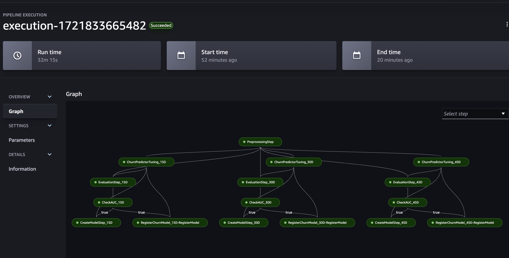

# Customer-Churn-SageMaker
Build, tune, and deploy an end-to-end churn prediction model using Amazon SageMaker Pipelines.

Customer Churn Model to predict if a customer would be retained or not.
1. Store Retail Dataset (https://www.kaggle.com/uttamp/store-data)
2. Binary Classification Model using Pytorch SimpleNN
3. Propensity models estimating the probability that a given customer will remain a paid customer over one time window: 15D, 30D, or 45D 

## Run Code:
1. Download and save the Store Retail Dataset (https://www.kaggle.com/uttamp/store-data) in the default Amazon Simple Storage Service (Amazon S3) bucket associated with your SageMaker session or in the S3 bucket of your choice. Also, create a folder "data" within the repo and save the dataset in this folder.
2. churn-pipeline.ipynb is used to launch the SageMaker Pipeline which would orchestrate each step of the model from preprocessing through creating model, running predictions etc..

## SageMaker Pipeline Workflow for Churn Model

## Steps
1. PreprocessingStep (SageMaker Processing Step)-  Preprocess data to build the features required and split data in train/test datasets.
2. ChurnPredictorTuning (SageMaker Tuning Step) - Applies HyperParameterTuning based on the ranges to give the best model which is determined based on AUC Score.
3. Feature Importance is calculated during the tuning stage and saved as csv in s3
4. EvaluationStep (SageMaker Processing Step)- Evaluates the best model using the test dataset.
5. CheckAUC (SageMaker Condition Step)- Check if the AUC Score is above a certain threshold.If true, run through the below steps.
6. RegisterChurnModel (SageMaker Register Model Step)- Register the trained churn model onto SageMaker Model Registry.
7. CreateModelStep (SageMaker Create Model Step)- Creates SageMaker Model by taking the artifacts of the best model

Inference
1. LambdaFunction is deployed with all the required libraries packaged as a Docker image. It refers to the trained model for inference results.
2. ApiGateway is configured to point to the lambda function to be able to access the endpoint for realtime inference.
